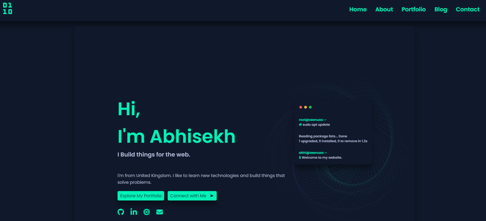

# zeenuxo.github.io

Responsive portfolio website built from scratch using Grid & Nested Grid layout.

Hello Test

<br>
Built with Passion, Love and HTML, CSS, JS.
<br>
Hosted on Github Pages - https://zeenuxo.github.io/

<br>

If you do decide to use my Design Idea please Attribute Me. 
I was inspired by Britanny Chiang at https://github.com/bchiang7. 

<br>

## Dependencies
```
lite-server
```

<br>

## Getting Started
```
npm install lite-server --save-dev
npm start
```

<br>

## Inside package.json...
```
 "scripts": {
    "lite": "lite-server --port 5501", 
    "start": "npm run lite"}
```




